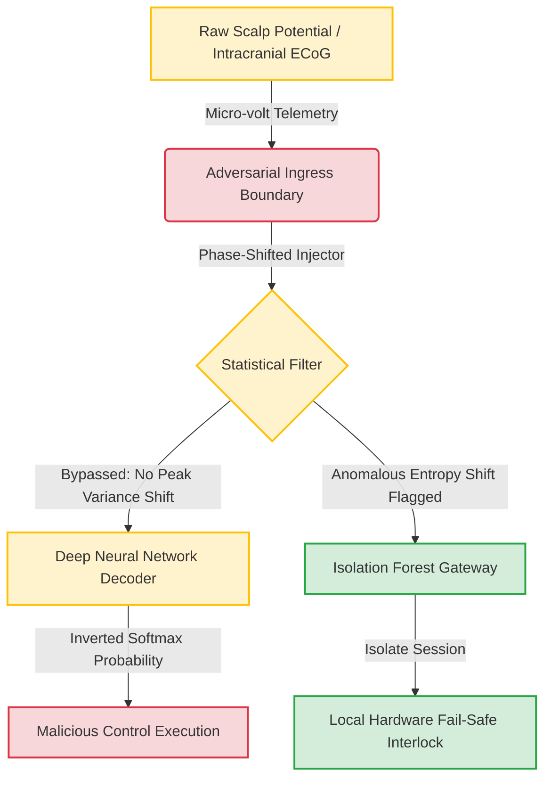

# neurocybersecurity-aml-framework
# Cryptographic Privacy Gaps and Adversarial Vulnerabilities in Closed-Loop Brain-Computer Interfaces (BCIs)

[](https://arxiv.org)
[](https://opensource.org)
[](#)

This repository hosts a formalized theoretical threat-modeling framework and computational paradigm evaluating the intersection of **Adversarial Machine Learning (AML)**, **Statistical Signal Processing**, and **Closed-Loop Neuromodulation Security**. 

The core research assesses how deep-learning-based electrophysiological decoders (e.g., EEG-based Motor Imagery classifiers) can be systematically subverted via sub-clinical, phase-shifted adversarial perturbations, alongside a proposed decentralized architecture for real-time verification.

---

## 🔬 1. Project Architecture & Deep Dives

To review the complete domain analysis, explore the specialized sub-modules built into this framework:

*   **[Mathematical Methodology Framework](METHODOLOGY.md)**: Formal proofs of $L_\infty$-bounded signal corruption, gradient descent optimization under perturbation constraints, and state-space validation.
*   **[Critical Literature Matrix](LITERATURE_REVIEW.md)**: Deep academic synthesis identifying systemic vulnerability patterns and methodology gaps across 10+ core BCI security studies.
*   **[Metadata Citation Engine](CITE.bib)**: Standardized BibTeX schemas for reference tracking within LaTeX-driven typesetting tools.

---

## 🧠 2. Conceptual Threat Vector Topology

The flowchart below traces the propagation of an adversarial manipulation from the raw physical sensing boundary to the digital machine learning inference pipeline.



---

## 💻 3. Implementation Blueprint

### Systems Deployment
To integrate these core threat-modeling boundaries with computational validation pipelines, clone this theoretical node alongside our operational execution engine:

```bash
# Clone the academic framework
git clone https://github.com
cd neurocybersecurity-aml-framework
```

---

## 🖋️ 4. Academic Attributions

If you leverage this conceptual paradigm, system topology, or mathematical definitions in your research, please cite the framework using the canonical index below:

```bibtex
@article{yourname2026neurocyber,
  author    = {Your Full Name},
  title     = {Cryptographic Privacy Gaps and Adversarial Vulnerabilities in Closed-Loop Brain-Computer Interfaces},
  journal   = {GitHub Digital Archive for Neural Engineering Researches},
  year      = {2026},
  url       = {https://github.com}
}
```
